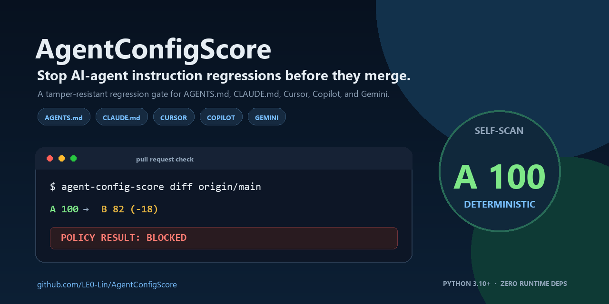
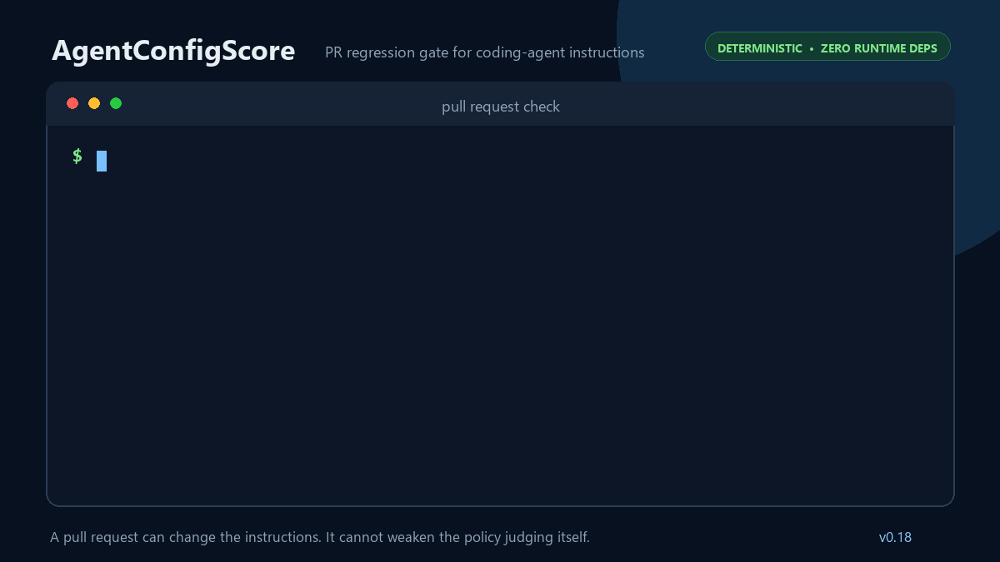
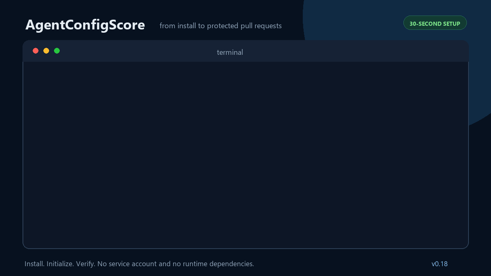
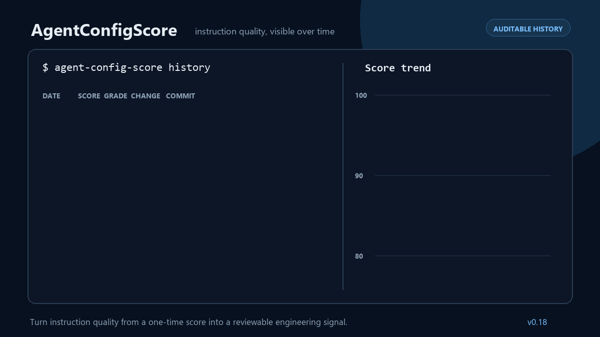
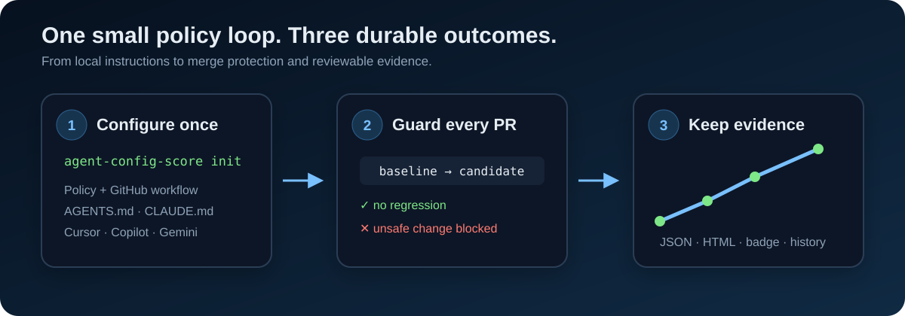

# Visual tour

AgentConfigScore turns coding-agent instruction quality into something a team can see, review, and enforce. These demos use representative CLI output and map directly to shipped commands.

## Shareable project card



The solid-background 1280×640 project card is optimized for GitHub link previews and remains readable when a social platform crops or scales it down.

## Catch a regression before merge



`agent-config-score diff` compares the candidate with a safe baseline. A new error or disallowed score drop blocks the pull request without letting the candidate weaken its own policy.

## Protect a repository in three commands



The normal setup path is intentionally small: install from PyPI, run `init`, then use the read-only `doctor` command to verify configuration, instructions, baseline detection, and the GitHub workflow.

## Make quality visible over time



Local history provides a human-readable trend. The reusable score-history workflow can also preserve immutable JSON, HTML, and badge artifacts for default-branch commits.

## How the pieces fit



The regression gate answers whether a pull request made instructions worse. History answers how instruction quality has changed across reviewed commits. They are separate signals with a shared scanner and policy model.

## Regenerate the gallery

The GIFs and social preview are generated from a source-controlled Pillow renderer rather than recorded from a particular operating system or shell:

```bash
python -m pip install pillow
python scripts/render_demo_gif.py --all
```

Commit the renderer and generated assets together so visual changes remain reviewable.
